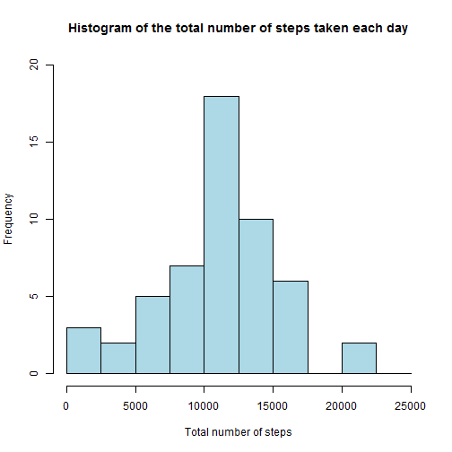
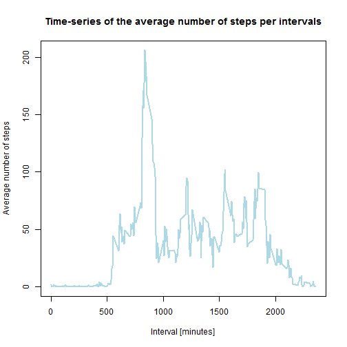
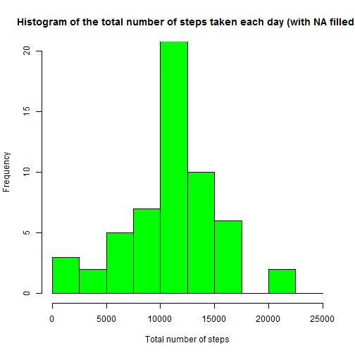
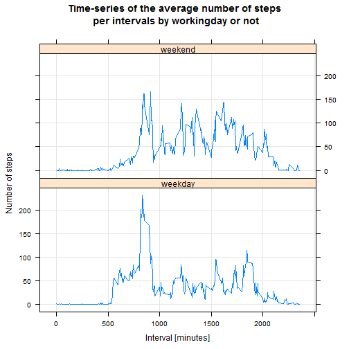

```
## [1] "C"
```

## Description

This analysys has been performed for the Reproducible Research assignement on **2016-04-16 20:49:22** with **R version 3.2.2 (2015-08-14)** version of R. 

This assignment makes use of data from a personal activity monitoring device. This device collects data at 5 minute intervals through out the day. The data consists of two months of data from an anonymous individual collected during the months of October and November, 2012 and include the number of steps taken in 5 minute intervals each day.

## Loading and preprocessing the data

1. Load the data (i.e. read.csv())


```r
temp <- tempfile()
download.file("https://d396qusza40orc.cloudfront.net/repdata%2Fdata%2Factivity.zip",temp)
unzip(temp, "activity.csv")
activity <- read.csv("activity.csv")
```

## What is mean total number of steps taken per day?

1. Calculate the total number of steps taken per day


```r
total_steps_day <- aggregate(steps~date, data=activity, sum, na.rm=TRUE)
```

2. Make a histogram of the total number of steps taken each day


```r
hist(total_steps_day$steps, 
     breaks=seq(from=0, to=25000, by=2500),
     col="lightblue", 
     xlab="Total number of steps", 
     ylim=c(0, 20), 
     main="Histogram of the total number of steps taken each day")
```



3. Calculate and report the mean and median of the total number of steps taken per day


```r
mean_steps_day <- round(mean(total_steps_day$steps),0)
median_steps_day <- round(median(total_steps_day$steps),0)
```

* The mean total number of steps taken per day is **10766** steps.
* The median total number of steps taken per day is **10765** steps.
    
## What is the average daily activity pattern?

1. Make a time series plot (i.e. type = "l") of the 5-minute interval (x-axis) and the average number of steps taken, averaged across all days (y-axis)


```r
mean_steps_interval <-aggregate(steps~interval,data=activity,mean,na.rm=TRUE)
plot(steps~interval, 
     data=mean_steps_interval, 
     type="l", 
     col="lightblue", 
     lwd=2, 
     xlab="Interval [minutes]", 
     ylab="Average number of steps", 
     main="Time-series of the average number of steps per intervals")
```



2. Which 5-minute interval, on average across all the days in the dataset, contains the maximum number of steps? 


```r
max_steps_interval <- mean_steps_interval[which.max(mean_steps_interval$steps),]$interval
```

* The **835**th interval contains the maximum number of steps.

## Imputing missing values

1. Calculate and report the total number of missing values in the dataset (i.e. the total number of rows with NAs)


```r
total_na <- sum(is.na(activity$steps))
```

* **2304** rows are missing.

2. Devise a strategy for filling in all of the missing values in the dataset. 


Basically, we will implement a strategy based on the mean of the 5 minute interval. According to the time serie plot, it's seems to be a first better choice because of the repetitiveness of days steps. Here a function which get the mean interval for a given interval :


```r
get_mean_interval<-function(interval){
    mean_steps_interval[mean_steps_interval$interval==interval,]$steps
}
```

3. Create a new dataset that is equal to the original dataset but with the missing data filled in.


```r
activity_2 <- activity   
for(r in 1:nrow(activity_2)){
  if (is.na(activity_2$steps[r])) {
    repl <- get_mean_interval(activity_2$interval[r])
    activity_2$steps[r] <- repl;
  }
}
```

4. Make a histogram of the total number of steps taken each day. Calculate and report the mean and median total number of steps taken per day. Do these values differ from the estimates from the first part of the assignment? What is the impact of imputing missing data on the estimates of the total daily number of steps?


```r
total_steps_day2 <-aggregate(steps~date,data=activity_2,sum)
hist(total_steps_day2$steps, 
     breaks=seq(from=0, to=25000, by=2500),
     col="green", 
     xlab="Total number of steps", 
     ylim=c(0, 20), 
     main="Histogram of the total number of steps taken each day (with NA filled)")
```



```r
mean_steps_day2 <- round(mean(total_steps_day2$steps),0)
median_steps_day2 <- round(median(total_steps_day2$steps),0)
```

* The mean total number of steps taken per day (with na value filled) is **10766** steps.
* The median total number of steps taken per day (with na value filled) is **10766** steps.

No (or very small) impact on mean and median total number of steps. The initial filling strategy (mean of a given the interval) performed well.

## Are there differences in activity patterns between weekdays and weekends?

1. Create a new factor variable in the dataset with two levels - "weekday" and "weekend" indicating whether a given date is a weekday or weekend day.


```r
activity_2$workingday <- "weekday"
activity_2$workingday[weekdays(as.Date(activity_2$date), abb=T) %in% c("Sat","Sun")] <- "weekend"
```

2. Make a panel plot containing a time series plot (i.e. type = "l") of the 5-minute interval (x-axis) and the average number of steps taken, averaged across all weekday days or weekend days (y-axis).


```r
mean_steps_interval_by_workingday <- aggregate(steps ~ interval + workingday, data=activity_2, mean)
xyplot(steps ~ interval | workingday, data=mean_steps_interval_by_workingday, type="l", grid=T, layout=c(1,2), ylab="Number of steps", xlab="Interval [minutes]", main="Time-series of the average number of steps\n per intervals by workingday or not")
```


